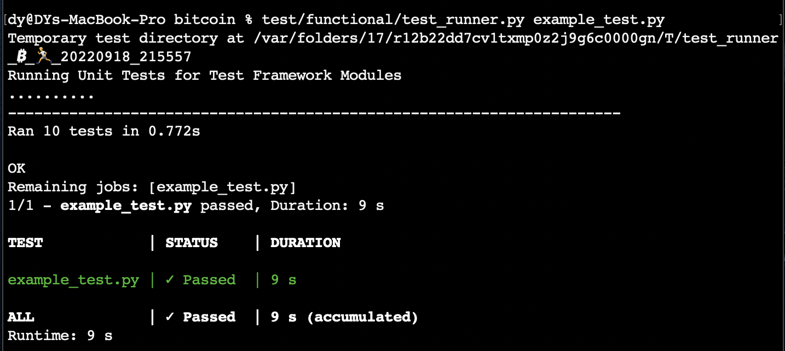

# Chaincode Labs Exercises

## 1. How To Build

Q. Compile Bitcoin Core ([https://github.com/bitcoin/bitcoin](https://github.com/bitcoin/bitcoin)). You can see doc/build-*.md for instructions on building the various elements.

1. ***`./autogen.sh`** — Prepares the files for build (based on your platform) and creates configure file. Creates Makefile*
2. ***`./configure`** — Creates make file, allowing ‘make’ commands to run.*
3. **`make`** — B*uilds (this might take a while).*
4. ***`make check`*** *— Builds and runs unit tests.*
5. ***`make deploy`** — Builds and creates a deployable application.*

Changing bitcoind data directory, conf directory

bitcoin.conf file in Application Support directory

```bash
bitcoind -datadir=/Volumes/Samsung_T5/Bitcoin -conf=/Volumes/Samsung_T5/Bitcoin
bitcoind --conf=/Volumes/Samsung_T5/Bitcoin
```

## 2. Running Test
Q. Run the unit and functional tests. Instructions on how to do that can be found here:

```bash
test/functional/test_runner.py feature_rbf.py
```



## 3. Complete Example Test
Q. Look at example_test.py in the functional test directory and try getting node 1 to mine another block, send it to node 2, and check that node 2 received it. In your response to this email, please include a link to a gist or code snippet that you used to complete this step.


Code: [https://github.com/dawntyim/bitcoin/blob/chaincodelab-exercises/test/functional/example_test.py](https://github.com/dawntyim/bitcoin/blob/chaincodelab-exercises/test/functional/example_test.py)

```python

self.generatetoaddress(self.nodes[1], 1, self.nodes[1].get_deterministic_priv_key().address)
best_block = self.nodes[1].getblock(self.nodes[1].getbestblockhash())
tip = int(self.nodes[1].getbestblockhash(), 16)
height = best_block["height"] + 1
block_time = best_block["time"] + 1

self.log.info("Wait for node1 to reach current tip (height 11) using RPC")
self.nodes[2].waitforblockheight(11)

self.log.info("Connect node2 and node1")
self.connect_nodes(1, 2)

self.log.info("Wait for node2 to receive all the blocks from node1")
self.sync_all()

assert_equal(int(self.nodes[1].getbestblockhash(), 16), int(self.nodes[2].getbestblockhash(), 16))
```

